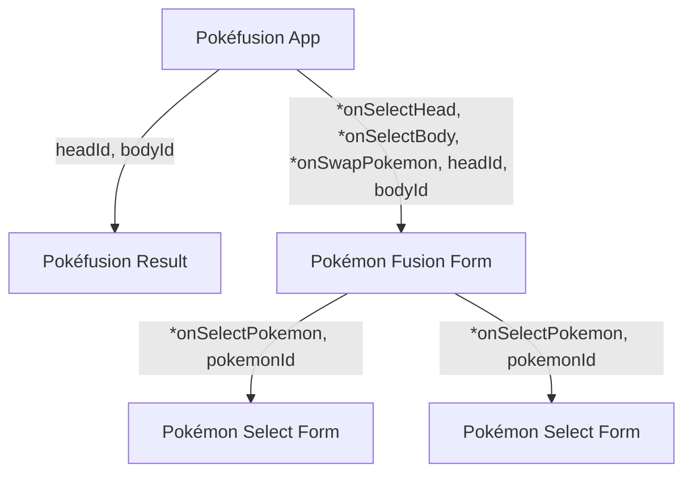

# Pokefusion

App to fuse pokémon together

```mermaid
graph TD
    A[Pokéfusion App] -->|headId, bodyId| B[Pokéfusion Result]
    A -->|*onSelectHead, *onSelectBody, *onSwapPokemon, headId, bodyId| C[Pokémon Fusion Form]
    C -->|*onSelectPokemon, pokemonId| D[Pokémon Select Form]
    C -->|*onSelectPokemon, pokemonId| E[Pokémon Select Form]
```
